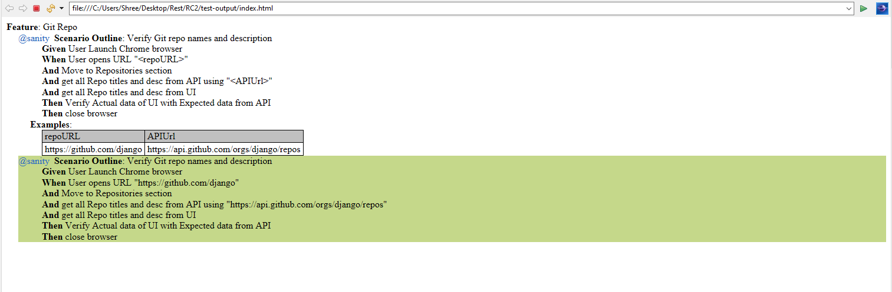

# SeleniumAndRestAssuredWithCucumber
This is a project to demonstrate how to Verify Git repo names and description from UI with Git repo names and description from API

# Instruction to run
1. Paste latest chrome Driver at ../CucumberSDETProject/Drivers
2. Go to ..\src\test\java\testRunner\TestRunner.java
3. TestScenario is added in /CucumberSDETProject/Features/GitRepo.feature , where one can give repoURL (For Actual) and API-URL (For Expected)
4. Right click and run as JUnit test
5. Report will be generated at ../CucumberSDETProject/test-output/index.html and will look like below

